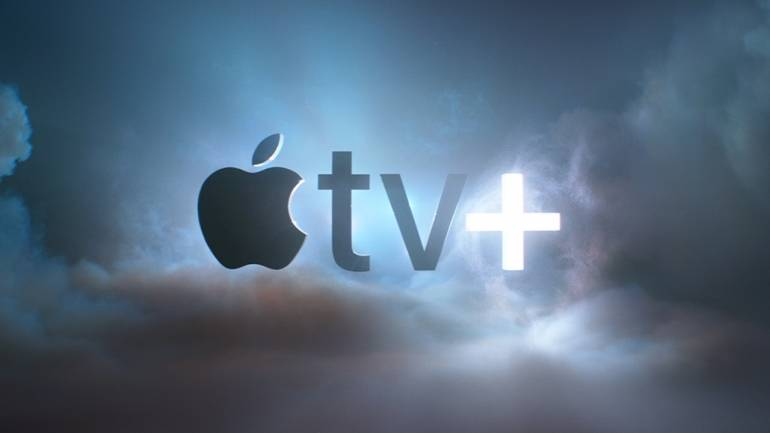
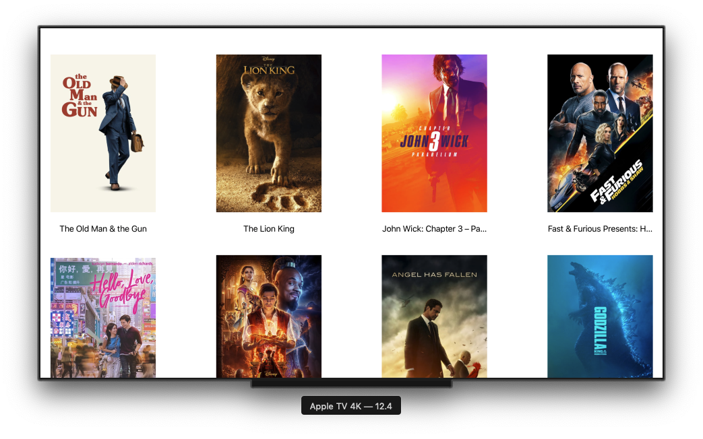
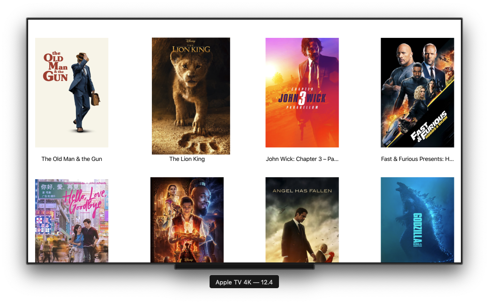

# Apple TV Popular Movies App 🎬



## How to build an Apple TV App Tutorial for tvOS ?

We will process and display the data received from the Internet.

I developed Apple TV application using TMDb.


https://www.themoviedb.org/documentation/api 👻

Pictures and names of films taken from the API are shown in the application.



The picture of the selected movie is highlighted. 👇🏻



## Resources 📚

- [How to build an Apple TV App Tutorial for tvOS](https://www.youtube.com/watch?v=XmLdEcq-QNI)

- [TMDb](https://developers.themoviedb.org/3/movies/get-popular-movies)

## License ℹ️
```
MIT License

Copyright (c) 2022 Halil OZEL

Permission is hereby granted, free of charge, to any person obtaining a copy
of this software and associated documentation files (the "Software"), to deal
in the Software without restriction, including without limitation the rights
to use, copy, modify, merge, publish, distribute, sublicense, and/or sell
copies of the Software, and to permit persons to whom the Software is
furnished to do so, subject to the following conditions:

The above copyright notice and this permission notice shall be included in all
copies or substantial portions of the Software.

THE SOFTWARE IS PROVIDED "AS IS", WITHOUT WARRANTY OF ANY KIND, EXPRESS OR
IMPLIED, INCLUDING BUT NOT LIMITED TO THE WARRANTIES OF MERCHANTABILITY,
FITNESS FOR A PARTICULAR PURPOSE AND NONINFRINGEMENT. IN NO EVENT SHALL THE
AUTHORS OR COPYRIGHT HOLDERS BE LIABLE FOR ANY CLAIM, DAMAGES OR OTHER
LIABILITY, WHETHER IN AN ACTION OF CONTRACT, TORT OR OTHERWISE, ARISING FROM,
OUT OF OR IN CONNECTION WITH THE SOFTWARE OR THE USE OR OTHER DEALINGS IN THE
SOFTWARE.
```


