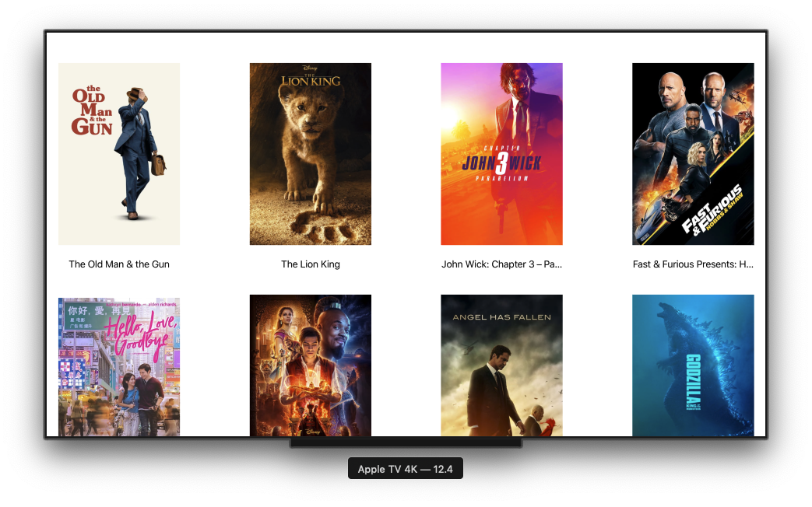
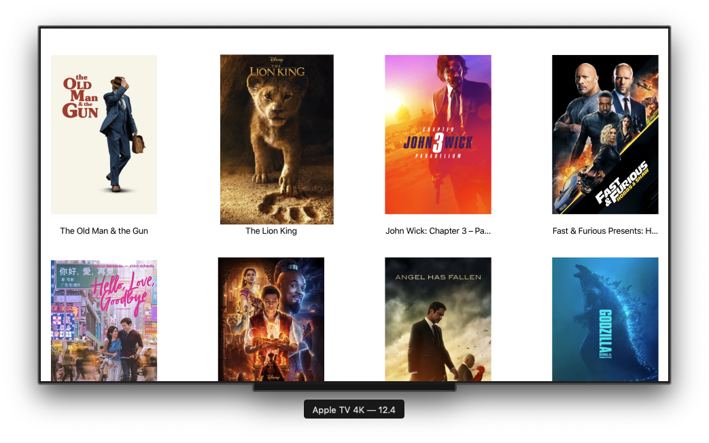

# Apple TV Popular Movies

A tvOS app that browses the movies currently popular on [TMDb](https://www.themoviedb.org/). Posters sit on a horizontal shelf. Moving the focus updates the title, year, rating, and a short overview.

## Features

- Popular-movie shelf from the TMDb API
- Focus that scales the poster, lifts a shadow, and draws a light ring
- Year, rating, and overview for the focused title
- Loading, empty, and error states, with a Try Again action
- Poster downloads cached in memory and kept off the main thread
- No third-party dependencies

## Requirements

- macOS with Xcode 16 or newer
- tvOS 18 SDK
- Apple TV simulator, or an Apple TV device
- A TMDb API key

## Setup

1. Clone this repository.
2. Open `AppleTVMovieApp.xcodeproj`.
3. The sample key lives under `TMDBAPIKey` in `AppleTVMovieApp/Info.plist`. Replace it with your own key from the [TMDb API settings](https://www.themoviedb.org/settings/api) before you share a build.
4. Select the **AppleTVMovieApp** scheme and an Apple TV destination.
5. If signing fails, set your Development Team under Signing & Capabilities. The project uses automatic signing.

## Run

Press Run. The app requests the first page of popular movies and fills the shelf. In the simulator, use the arrow keys to move between posters. On a remote, swipe. If the request fails, move to **Try Again** and select it.

## Architecture

The app is UIKit. `SceneDelegate` creates the window and shows `ViewController`. There is no storyboard: the shelf, focus metadata, and status screens are built in code so spacing and focus stay consistent.

`MovieService` calls `GET /3/movie/popular` with `URLSession` and decodes the page into `Movie` values. `ImageLoader` fetches `w780` posters and keeps an in-memory cache. `MovieCell` draws one card and cancels a stale download when the cell is reused.

```text
AppleTVMovieApp/
  AppDelegate.swift       app entry
  SceneDelegate.swift     window and root view controller
  ViewController.swift    shelf, focus, loading, and error
  MovieCell.swift         poster card
  Movie.swift             decoded movie
  MovieService.swift      TMDb request
  ImageLoader.swift       poster cache
  Theme.swift             color and size constants
  Info.plist              API key, scene manifest, launch color
  Assets.xcassets         icon, top shelf, and backdrop color
```

The deployment target is tvOS 18. The app only talks to HTTPS endpoints.

## Screenshots

These captures are from the original Apple TV build: the popular shelf, and the poster that grows when it is focused. The current interface keeps that shelf and adds the title lockup, the focused film's year, rating, and overview, plus loading, empty, and error states. Capture new simulator screenshots in Xcode after you run the app; this repository does not include fresh device shots of that layout.





## License

MIT License

Copyright (c) 2022 Halil OZEL

Permission is hereby granted, free of charge, to any person obtaining a copy of this software and associated documentation files (the "Software"), to deal in the Software without restriction, including without limitation the rights to use, copy, modify, merge, publish, distribute, sublicense, and/or sell copies of the Software, and to permit persons to whom the Software is furnished to do so, subject to the following conditions:

The above copyright notice and this permission notice shall be included in all copies or substantial portions of the Software.

THE SOFTWARE IS PROVIDED "AS IS", WITHOUT WARRANTY OF ANY KIND, EXPRESS OR IMPLIED, INCLUDING BUT NOT LIMITED TO THE WARRANTIES OF MERCHANTABILITY, FITNESS FOR A PARTICULAR PURPOSE AND NONINFRINGEMENT. IN NO EVENT SHALL THE AUTHORS OR COPYRIGHT HOLDERS BE LIABLE FOR ANY CLAIM, DAMAGES OR OTHER LIABILITY, WHETHER IN AN ACTION OF CONTRACT, TORT OR OTHERWISE, ARISING FROM, OUT OF OR IN CONNECTION WITH THE SOFTWARE OR THE USE OR OTHER DEALINGS IN THE SOFTWARE.

## Acknowledgements

The original project is by Halil Özel. Movie data and poster images come from TMDb.

This product uses the TMDb API but is not endorsed or certified by TMDb.
