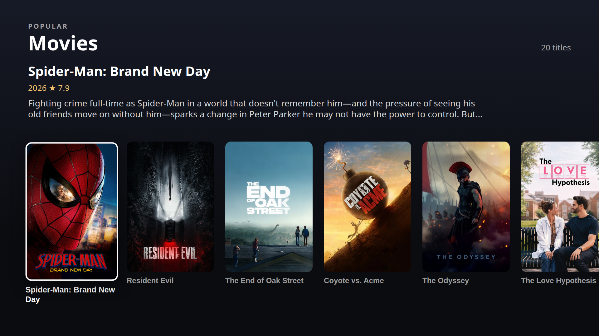
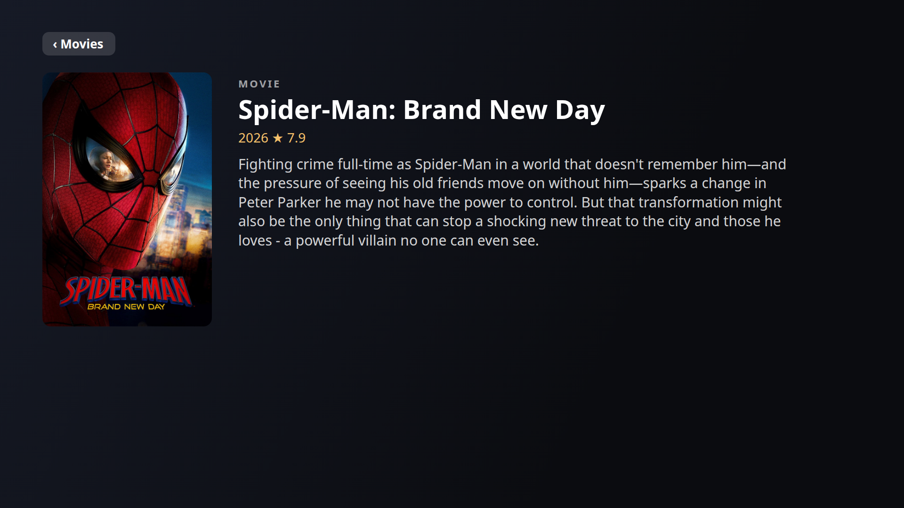

# Apple TV Popular Movies

A tvOS app for the movies that are popular on [TMDb](https://www.themoviedb.org/) right now. The home screen is a poster shelf. Selecting a title opens its detail page.





## Features

- First page of popular movies, with poster, title, year, rating, and a two-line overview on the focused card
- Detail page for the selected movie: large poster, title, year, rating, and the full overview
- Movies button, and the menu button, return to the shelf
- Loading, empty, and error states on the shelf, each with Try Again when a request fails
- Loading and error states on the detail page, with Try Again and a way back
- Poster images downloaded off the main thread and kept in a memory cache
- UIKit only. No third-party packages

## Requirements

- macOS with Xcode 16 or later
- tvOS 18 SDK
- Apple TV simulator or an Apple TV
- A TMDb v3 API key

## Getting started

1. Clone the repository and open `AppleTVMovieApp.xcodeproj`.
2. The key is `TMDBAPIKey` in `AppleTVMovieApp/Info.plist`. A sample key is included so the project runs. Replace it with your own key from [TMDb API settings](https://www.themoviedb.org/settings/api) before you share a build.
3. Select the **AppleTVMovieApp** scheme and an Apple TV destination.
4. If signing fails, set your Development Team under Signing & Capabilities. Signing is automatic.

In the simulator, the arrow keys move along the shelf and Return opens the focused title. On a remote, swipe to move and press to select. Menu returns to the shelf.

## Architecture

`SceneDelegate` creates a navigation stack with a hidden bar. `ViewController` loads `GET /3/movie/popular` and owns the shelf. Selecting a poster pushes `MovieDetailViewController`, which loads `GET /3/movie/{id}`. `Movie` decodes both responses. `ImageLoader` fetches `w780` posters. The deployment target is tvOS 18, and every request is HTTPS.

```text
AppleTVMovieApp/
  AppDelegate.swift              app entry
  SceneDelegate.swift            window and navigation stack
  ViewController.swift           shelf, focus lockup, catalog status
  MovieDetailViewController.swift  detail page
  MovieCell.swift                poster card
  Movie.swift                    decoded movie
  MovieService.swift             popular list and movie details
  ImageLoader.swift              poster cache
  Theme.swift                    color and size constants
  Info.plist                     API key, scene manifest, launch color
  Assets.xcassets                icon, top shelf, backdrop color
```

## License

MIT License

Copyright (c) 2022 Halil OZEL

Permission is hereby granted, free of charge, to any person obtaining a copy of this software and associated documentation files (the "Software"), to deal in the Software without restriction, including without limitation the rights to use, copy, modify, merge, publish, distribute, sublicense, and/or sell copies of the Software, and to permit persons to whom the Software is furnished to do so, subject to the following conditions:

The above copyright notice and this permission notice shall be included in all copies or substantial portions of the Software.

THE SOFTWARE IS PROVIDED "AS IS", WITHOUT WARRANTY OF ANY KIND, EXPRESS OR IMPLIED, INCLUDING BUT NOT LIMITED TO THE WARRANTIES OF MERCHANTABILITY, FITNESS FOR A PARTICULAR PURPOSE AND NONINFRINGEMENT. IN NO EVENT SHALL THE AUTHORS OR COPYRIGHT HOLDERS BE LIABLE FOR ANY CLAIM, DAMAGES OR OTHER LIABILITY, WHETHER IN AN ACTION OF CONTRACT, TORT OR OTHERWISE, ARISING FROM, OUT OF OR IN CONNECTION WITH THE SOFTWARE OR THE USE OR OTHER DEALINGS IN THE SOFTWARE.

## Data

Movie data and poster images are provided by TMDb. This product uses the TMDb API but is not endorsed or certified by TMDb.
